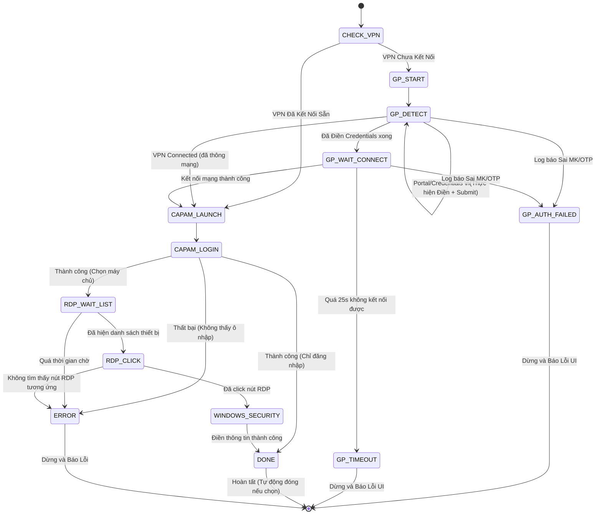

# Hướng Dẫn Nghiệp Vụ & Luồng Xử Lý Chi Tiết (AutoSignCAPAM)

Tài liệu này mô tả chi tiết kiến trúc điều phối theo máy trạng thái (**FSM - Finite State Machine**), các trường hợp xử lý (rẽ nhánh), cơ chế nhận diện hình ảnh/đọc log và cách xử lý lỗi của phần mềm **AutoSignCAPAM** (phiên bản Windows/Linux).

---

## 1. Bản Đồ Trạng Thái Tổng Quan (FSM Diagram)

Dưới đây là sơ đồ luồng hoạt động chuyển trạng thái của tiến trình tự động hóa trong [core/state_machine.py](file:///d:/Repos/AutoSignCAPAM/core/state_machine.py):

---

## 2. Chi Tiết Luồng Tự Động Hóa (Từng Bước & Rẽ Nhánh)

### Bước 1: Kiểm tra kết nối VPN ban đầu (`CHECK_VPN`)
* **Cách thực hiện:** Thử kết nối TCP socket tới IP của máy chủ CAPAM (`capam_ip`) trên cổng `443` với timeout `2 giây` (xem tại [core/gp_handler.py](file:///d:/Repos/AutoSignCAPAM/core/gp_handler.py)).
* **Rẽ nhánh:**
  * **Trường hợp A (Thành công):** Nếu kết nối được thông suốt $\rightarrow$ Bỏ qua hoàn toàn các bước đăng nhập VPN GlobalProtect $\rightarrow$ Chuyển thẳng sang bước khởi chạy CAPAM (`CAPAM_LAUNCH`).
  * **Trường hợp B (Thất bại):** Nếu không kết nối được $\rightarrow$ Chuyển sang bước khởi chạy VPN (`GP_START`).

---

### Bước 2: Khởi chạy và Đăng nhập GlobalProtect (`GP_START` & `GP_DETECT`)
* **Cách khởi chạy:** 
  * Windows: Chạy file `PanGPA.exe` từ thư mục Program Files hoặc dùng lệnh gọi shortcut (xem tại [adapters/windows.py](file:///d:/Repos/AutoSignCAPAM/adapters/windows.py)).
  * Chờ `1.5 giây` để cửa sổ hiển thị, sau đó dùng win32 API để force focus cửa sổ lên trên cùng.
* **Đọc trạng thái (VPN State Check):** Đọc file log `PanGPA.log` (hỗ trợ cả Windows và Linux).
  * **Trường hợp A: Log trả về `PORTAL`** (Màn hình nhập địa chỉ Portal):
    * *Hành động:* Quét OpenCV tìm tọa độ ô nhập (profile `gp`). Nếu không có contour rõ ràng $\rightarrow$ Tự động chuyển sang fallback dùng tọa độ tỷ lệ phần trăm (ở khoảng **78%** chiều cao cửa sổ).
    * *Thao tác:* Click ô nhập $\rightarrow$ `Ctrl + A` $\rightarrow$ `Backspace` $\rightarrow$ Nhập `vpn.gdt.gov.vn` $\rightarrow$ Ấn `Enter`.
    * *Đợi:* Chờ `5 giây` để load trang đăng nhập tài khoản $\rightarrow$ Lặp lại vòng lặp `GP_DETECT`.
  * **Trường hợp B: Log trả về `CREDENTIALS`** (Màn hình nhập User/Pass):
    * *Hành động:* Quét OpenCV tìm 2 ô nhập. Nếu không có contour $\rightarrow$ Dùng tọa độ tỷ lệ phần trăm: Ô Username (ở **59%** chiều cao), ô Password (ở **69%** chiều cao).
    * *Thao tác:* Điền tài khoản $\rightarrow$ Điền mật khẩu ghép (`Mật khẩu tĩnh` + `Mã OTP 6 số`) $\rightarrow$ Đo kích thước log hiện tại để làm điểm mốc $\rightarrow$ Ấn `Enter` $\rightarrow$ Chuyển sang trạng thái đợi kết nối (`GP_WAIT_CONNECT`).
  * **Trường hợp C: Log trả về `CONNECTED`**:
    * *Hành động:* Bỏ qua đăng nhập $\rightarrow$ Chuyển sang bước khởi chạy CAPAM (`CAPAM_LAUNCH`).
  * **Trường hợp D: Log trả về `AUTH_FAILED`** (Sai thông tin đăng nhập):
    * *Hành động:* Dừng chương trình ngay lập tức $\rightarrow$ Chuyển sang trạng thái dừng lỗi (`GP_AUTH_FAILED`) và báo lỗi đỏ lên giao diện.

---

### Bước 3: Đợi Kết Nối Mạng VPN (`GP_WAIT_CONNECT`)
* **Thời gian chờ:** Tối đa `25 giây`.
* **Cơ chế Polling (Mỗi 0.5s thực hiện 2 việc):**
  1. Thử kết nối socket tới IP CAPAM (cổng 443). Nếu kết nối được $\rightarrow$ Trả về `CONNECTED`.
  2. Đọc file log từ điểm mốc trước khi ấn Enter. Nếu thấy xuất hiện chuỗi `<portal-status>User authentication failed</portal-status>` hoặc `Authentication Failed` $\rightarrow$ Trả về `AUTH_FAILED`.
* **Rẽ nhánh:**
  * Nếu trả về `CONNECTED` $\rightarrow$ Chuyển sang `CAPAM_LAUNCH`.
  * Nếu trả về `AUTH_FAILED` $\rightarrow$ Chuyển sang `GP_AUTH_FAILED` (Dừng & báo lỗi sai thông tin đăng nhập).
  * Nếu hết `25 giây` vẫn không kết nối được $\rightarrow$ Chuyển sang `GP_TIMEOUT` (Dừng & báo lỗi quá thời gian kết nối).

---

### Bước 4: Khởi chạy và Đăng nhập CAPAM Client (`CAPAM_LAUNCH` & `CAPAM_LOGIN`)
* **Khởi chạy:** Tìm kiếm file `CAPAMClient.exe` (quét danh sách thư mục cài đặt thường gặp + đọc Windows Registry HKLM/HKCU).
* **Đợi cửa sổ đăng nhập:** Chờ tối đa `15 giây` cho đến khi cửa sổ có tiêu đề `"Symantec Privileged Access Manager"` hiển thị và OpenCV phát hiện đủ 2 ô nhập liệu.
* **Tương tác điền:**
  * Điền `Username` vào ô đầu tiên.
  * Điền `Mật khẩu tĩnh` (Password Prefix - bước này không cộng OTP) vào ô thứ hai.
  * Ấn `Enter`.
* **Rẽ nhánh:**
  * Nếu người dùng chọn **"Chỉ đăng nhập"** trên giao diện chính $\rightarrow$ Chuyển sang trạng thái hoàn tất (`DONE`).
  * Nếu người dùng chọn kết nối **RDP-200** hoặc **Terminal-12** $\rightarrow$ Chuyển sang màn hình chờ danh sách thiết bị (`RDP_WAIT_LIST`).

---

### Bước 5: Chọn Thiết Bị RDP/Terminal (`RDP_WAIT_LIST` & `RDP_CLICK`)
* **Chờ danh sách thiết bị:** Chờ tối đa `20 giây` cho đến khi xuất hiện cửa sổ có tiêu đề chứa IP kết nối, ví dụ: `"Symantec Privileged Access Manager Client - 10.64.213.188"`.
* **Nhận diện và Click (Template Matching):**
  * Phần mềm chụp ảnh toàn màn hình.
  * Dùng thuật toán template matching của OpenCV (độ khớp tối thiểu `0.65`) để tìm:
    1. Nhãn thiết bị (file `template_200.png` hoặc `template_12.png` tương ứng).
    2. Tất cả các nút RDP xuất hiện trên màn hình (dựa vào `template_rdp.png`).
  * Tính toán khoảng cách tọa độ trục Y: Tìm nút RDP có trục Y gần với trục Y của thiết bị nhất (phạm vi sai lệch tối đa `45px`).
  * Thực hiện Click chuột vào trung tâm của nút RDP đó.
* **Rẽ nhánh:**
  * Nếu click thành công $\rightarrow$ Chuyển sang trạng thái điền bảo mật RDP (`WINDOWS_SECURITY`).
  * Nếu quá `30 giây` (thử quét lại mỗi 1s) mà không khớp được hình ảnh $\rightarrow$ Báo lỗi `ERROR` (Quá thời gian tải danh sách/Lệch template).

---

### Bước 6: Điền bảng Bảo Mật RDP (`WINDOWS_SECURITY`)
* **Đợi cửa sổ:** Chờ tối đa `20 giây` cho đến khi cửa sổ Windows Security xuất hiện.
* **Nhận diện ô:** Chụp ảnh cửa sổ Windows Security, dùng OpenCV phát hiện 2 ô nhập liệu (Username và Password).
* **Thao tác điền:**
  * Ô 1: Điền `Username`.
  * Ô 2: Điền `Password` (Mật khẩu tĩnh).
  * Ấn `Enter`.
* **Kết thúc:** Chuyển sang trạng thái hoàn tất (`DONE`).

---

## 3. Các Điểm Cần Lưu Ý Khi Tinh Chỉnh

1. **Sai lệch tọa độ click chuột trên Windows:**
   * Hiện tại, file [config.py](file:///d:/Repos/AutoSignCAPAM/config.py) đã kích hoạt chế độ `SetProcessDpiAwareness(2)`. Nếu màn hình của bạn có tỉ lệ scale khác 100% (ví dụ 125% hoặc 150%), Windows sẽ tự động ánh xạ đúng tọa độ pixel thật. Không được gỡ bỏ phần cấu hình này.
2. **Khi thay đổi giao diện hay IP CAPAM:**
   * Nếu IP CAPAM đổi $\rightarrow$ Tool sẽ tự động dò tìm cửa sổ danh sách thiết bị theo IP mới (vì tiêu đề cửa sổ CAPAM phụ thuộc vào IP này).
   * Nếu nút RDP trên giao diện CAPAM thay đổi hình ảnh $\rightarrow$ Cần chụp lại ảnh nút RDP mới và ghi đè vào file `template_rdp.png`.
3. **Cơ chế đọc log GlobalProtect:**
   * Đường dẫn log mặc định được đặt tại: `%USERPROFILE%\AppData\Local\Palo Alto Networks\GlobalProtect\PanGPA.log`. Nếu máy cài đặt ở đường dẫn khác, bạn cần cập nhật lại trong [adapters/windows.py](file:///d:/Repos/AutoSignCAPAM/adapters/windows.py#L182).
