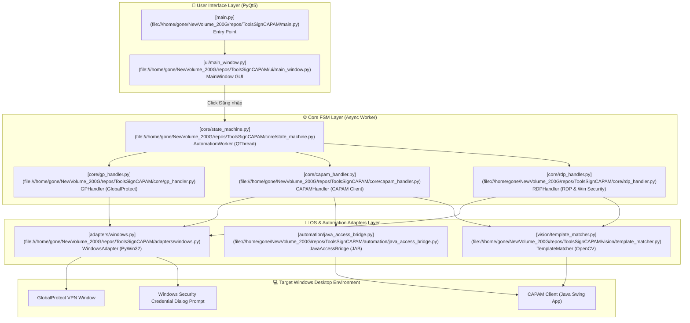

# 📘 Hướng Dẫn Kiến Trúc & Cấu Trúc Nhánh Windows (`ToolsSignCAPAM`)

Tài liệu này tổng hợp toàn bộ thông tin chi tiết về **nhánh `windows`** của dự án **ToolsSignCAPAM**: các công nghệ cốt lõi, sơ đồ kiến trúc tổng thể, luồng hoạt động từng bước, cũng như chức năng chi tiết của **từng thư mục và từng file** trong dự án.

---

## 📑 Mục Lục
1. [Các Công Nghệ Cốt Lõi Sử Dụng](#1-các-công-nghệ-cốt-lõi-sử-dụng)
2. [Sơ Đồ Kiến Trúc Hệ Thống](#2-sơ-đồ-kiến-trúc-hệ-thống)
3. [Luồng Tự Động Hóa Từ Bao Quát Đến Chi Tiết](#3-luồng-tự-động-hóa-từ-bao-quát-đến-chi-tiết)
4. [Chi Tiết Cấu Trúc Thư Mục & Tác Dụng Từng File](#4-chi-tiết-cấu-trúc-thư-mục--tác-dụng-từng-file)
   - [Thư mục Gốc (Root)](#-thư-mục-gốc-root)
   - [Thư mục `core/`](#-thư-mục-core)
   - [Thư mục `adapters/`](#-thư-mục-adapters)
   - [Thư mục `automation/`](#-thư-mục-automation)
   - [Thư mục `vision/`](#-thư-mục-vision)
   - [Thư mục `recognition/`](#-thư-mục-recognition)
   - [Thư mục `capture/`](#-thư-mục-capture)
   - [Thư mục `ui/`](#-thư-mục-ui)
   - [Thư mục `diagnostics/`](#-thư-mục-diagnostics)
   - [Thư mục `tools/` & `scratch/`](#-thư-mục-tools--scratch)
   - [Thư mục `tests/`](#-thư-mục-tests)

---

## 🛠️ 1. Các Công Nghệ Cốt Lõi Sử Dụng

| Công Nghệ / Thư Viện | Mục Đích & Tác Dụng Chi Tiết | File Tham Chiếu Chính |
| :--- | :--- | :--- |
| **PyQt5** | Dựng giao diện đồ họa người dùng (GUI), quản lý luồng chạy nền (`QThread`) giúp ứng dụng mượt mà không bị treo đơ GUI khi đang thực thi tự động hóa. | [ui/main_window.py](file:///home/gone/NewVolume_200G/repos/ToolsSignCAPAM/ui/main_window.py) |
| **PyWin32 (`win32gui`, `win32con`, `win32process`, `win32api`, `ctypes`)** | Tương tác trực tiếp Win32 API của Windows OS: Tìm kiếm cửa sổ (`EnumWindows`), lấy tiêu đề/HWND, đưa cửa sổ lên Foreground (`SetForegroundWindow`), lấy tọa độ cửa sổ (`GetWindowRect`), phát hiện DPI awareness và mô phỏng gõ phím/chuột cấp thấp (`SendInput`). | [adapters/windows.py](file:///home/gone/NewVolume_200G/repos/ToolsSignCAPAM/adapters/windows.py) |
| **OpenCV (`cv2`) & NumPy** | Xử lý ảnh & Computer Vision: Sử dụng phương pháp **Template Matching** (`cv2.matchTemplate`) với thuật toán `cv2.TM_CCOEFF_NORMED` để quét tìm nút bấm RDP, nhãn máy đích (200, 12) trên màn hình Java CAPAM Client. | [vision/template_matcher.py](file:///home/gone/NewVolume_200G/repos/ToolsSignCAPAM/vision/template_matcher.py) |
| **Java Access Bridge (JAB)** | Công nghệ giao tiếp với ứng dụng Java Swing/AWT. Do ứng dụng CAPAM Client được viết bằng Java, module JAB giúp tool bóc tách cây giao diện Java, lấy thông tin các ô Input (Username/Password) và bấm button trực tiếp mà không cần dựa vào tọa độ chuột. | [automation/java_access_bridge.py](file:///home/gone/NewVolume_200G/repos/ToolsSignCAPAM/automation/java_access_bridge.py) |
| **PyAutoGUI / PyScreeze / Pillow** | Mô phỏng chuột/bàn phím cấp cao và chụp ảnh màn hình vùng cửa sổ (bounding box window capture). | [capture/window_capture.py](file:///home/gone/NewVolume_200G/repos/ToolsSignCAPAM/capture/window_capture.py) |
| **PyInstaller** | Đóng gói toàn bộ nguồn Python thành tệp thực thi độc lập `.exe` chạy trực tiếp trên Windows không cần cài Python. | [build_windows.bat](file:///home/gone/NewVolume_200G/repos/ToolsSignCAPAM/build_windows.bat) |

---

## 🏗️ 2. Sơ Đồ Kiến Trúc Hệ Thống



---

## 🔄 3. Luồng Tự Động Hóa Chi Tiết Từ A Đến Z (End-to-End Workflow)

```
[Giai đoạn A: Startup] -> [Giai đoạn B: User Trigger] -> [Giai đoạn C: FSM Async] -> [Giai đoạn D: GP VPN] 
                                                                                               │
[Giai đoạn Z: Completion] <- [Giai đoạn G: Win Security] <- [Giai đoạn F: Select RDP] <- [Giai đoạn E: CAPAM Client]
```

### 📋 Chi Tiết Từng Bước Trong Tiến Trình (Từ Bước 1 Đến Bước 27)

#### **Giai đoạn A: Khởi động Ứng dụng & Cấu hình Môi trường (Startup & Setup)**
1. **[Khởi chạy app]**: Người dùng chạy file `CAPAM AutoSign.exe` (hoặc `python main.py`).
2. **[Đăng ký DPI Awareness]**: `main.py` nạp `config.py`. `config.py` gọi Win32 API (`SetProcessDpiAwarenessContext`) đăng ký ứng dụng High-DPI Aware với Windows OS (tránh lệch tọa độ chuột khi màn hình Windows scale 125%, 150%). File: [config.py:L32-L46](file:///home/gone/NewVolume_200G/repos/ToolsSignCAPAM/config.py#L32-L46)
3. **[Khởi tạo GUI PyQt5]**: `main.py` tạo `QApplication(sys.argv)`, cấu hình font chữ Segoe UI và hiển thị `MainWindow`. File: [main.py:L18-L27](file:///home/gone/NewVolume_200G/repos/ToolsSignCAPAM/main.py#L18-L27)
4. **[Load Cài Đặt Cục Bộ]**: `MainWindow` đọc cấu hình đã lưu từ file JSON local (`~/.capam_autosign_settings.json`) để tự động điền Username, Password Prefix, IP CAPAM, Lựa chọn máy RDP. File: [ui/main_window.py:L80-L130](file:///home/gone/NewVolume_200G/repos/ToolsSignCAPAM/ui/main_window.py#L80-L130)

#### **Giai đoạn B: Người dùng Nhập liệu & Kích hoạt (User Trigger)**
5. **[Nhập mã OTP]**: Người dùng mở ứng dụng Authenticator, nhập mã OTP 6 chữ số vào ô "Mã OTP" trên giao diện.
6. **[Bấm Nút Đăng Nhập]**: Người dùng bấm nút **"Tiến hành đăng nhập"**.
7. **[Lưu Settings Cập Nhật]**: UI tự động lưu lại các trường dữ liệu cố định vào file JSON.
8. **[Khóa Nút Bấm GUI]**: Disable tạm thời nút Đăng nhập trên UI để tránh thao tác bấm lặp. File: [ui/main_window.py:L210-L230](file:///home/gone/NewVolume_200G/repos/ToolsSignCAPAM/ui/main_window.py#L210-L230)
9. **[Tạo Worker Thread Chạy Nền]**: UI khởi tạo luồng `AutomationWorker` (kế thừa `QThread`) và gọi `.start()`. Việc này đẩy toàn bộ công việc tự động hóa chạy ngầm dưới background, không gây đơ giao diện PyQt5. File: [ui/main_window.py:L225-L245](file:///home/gone/NewVolume_200G/repos/ToolsSignCAPAM/ui/main_window.py#L225-L245)

#### **Giai đoạn C: Khởi Tạo FSM State Machine (Async Core Execution)**
10. **[Lựa chọn Adapter]**: `AutomationWorker` gọi `get_os_adapter()` khởi tạo `WindowsAdapter` tương tác Win32 API. File: [adapters/__init__.py](file:///home/gone/NewVolume_200G/repos/ToolsSignCAPAM/adapters/__init__.py)
11. **[Bắt đầu Vòng Lặp FSM]**: `AutomationWorker.run()` khởi chạy động cơ FSM (`StateMachine`), bắt đầu đo thời gian tiến trình ghi log vào `TimelineWriter`. File: [core/state_machine.py:L55-L100](file:///home/gone/NewVolume_200G/repos/ToolsSignCAPAM/core/state_machine.py#L55-L100)

#### **Giai đoạn D: Bước 1 — Xử lý GlobalProtect VPN (`GPHandler`)**
12. **[Dò Cửa Sổ GP]**: `GPHandler` gọi `windows_discovery.py` quét danh sách `HWND` các cửa sổ ứng dụng GlobalProtect trên hệ thống. File: [adapters/windows_discovery.py:L30-L50](file:///home/gone/NewVolume_200G/repos/ToolsSignCAPAM/adapters/windows_discovery.py#L30-L50)
13. **[Đăng nhập GP VPN (Nếu cần)]**:
    - Nếu GP đã ở trạng thái `STATE_CONNECTED` -> Bỏ qua, chuyển ngay sang bước CAPAM.
    - Nếu GP ở màn hình nhập liệu -> Tool đưa cửa sổ GP lên trước (`SetForegroundWindow(hwnd)`), điền mật khẩu/OTP và gửi yêu cầu Connect. File: [core/gp_handler.py:L80-L150](file:///home/gone/NewVolume_200G/repos/ToolsSignCAPAM/core/gp_handler.py#L80-L150)

#### **Giai đoạn E: Bước 2 — Đăng Nhập CAPAM Client (`CAPAMHandler`)**
14. **[Bắt Cửa Sổ Java CAPAM]**: `CAPAMHandler` quét tìm cửa sổ CAPAM Client dựa trên Class Name Java (`SunAwtFrame`) hoặc Title chứa IP CAPAM.
15. **[Tương tác bằng Java Access Bridge (JAB)]**:
    - **Phương án chính (JAB)**: Module `automation/java_access_bridge.py` kết nối với API Java Swing, truy xuất đối tượng `AccessibleContext` của ô User, ô Password và nút Sign In. Tool truyền chuỗi `password_prefix + otp` vào ô input và kích hoạt action Click nút Sign In trực tiếp mà không cần dùng chuột. File: [automation/java_access_bridge.py:L80-L160](file:///home/gone/NewVolume_200G/repos/ToolsSignCAPAM/automation/java_access_bridge.py#L80-L160)
    - **Phương án dự phòng (OpenCV Fallback)**: Nếu JAB không khả dụng, tool chụp ảnh màn hình cửa sổ (`window_capture.py`), dùng `vision/field_detector.py` quét vị trí 2 ô input và di chuyển chuột đến nhấp gõ phím. File: [core/capam_handler.py:L100-L180](file:///home/gone/NewVolume_200G/repos/ToolsSignCAPAM/core/capam_handler.py#L100-L180)
16. **[Chờ Đăng Nhập Thành Công]**: Tool đứng đợi màn hình danh sách máy chủ CAPAM xuất hiện.

#### **Giai đoạn F: Bước 3 — Định Vị Máy Đích (200/12) & Bấm RDP (`RDPHandler`)**
17. **[Kiểm Tra Lựa Chọn Máy]**: Đọc cấu hình máy đích do người dùng chọn (máy 200 hoặc 12).
18. **[Chụp Ảnh Khung Danh Sách Máy]**: `RDPHandler` dùng `capture/window_capture.py` chụp ảnh khu vực làm việc của ứng dụng CAPAM. File: [capture/window_capture.py:L30-L60](file:///home/gone/NewVolume_200G/repos/ToolsSignCAPAM/capture/window_capture.py#L30-L60)
19. **[Quét Tìm Nhãn Máy bằng OpenCV]**:
    - Nạp ảnh mẫu `template_200.png` hoặc `template_12.png`.
    - Dùng `vision/template_matcher.py` gọi thuật toán `cv2.matchTemplate(..., cv2.TM_CCOEFF_NORMED)` để xác định vị trí tọa độ `(x, y)` của nhãn máy trên màn hình. File: [vision/template_matcher.py:L30-L70](file:///home/gone/NewVolume_200G/repos/ToolsSignCAPAM/vision/template_matcher.py#L30-L70)
20. **[Click Nút RDP]**:
    - Quét tìm biểu tượng nút bấm RDP (`template_rdp.png`) trên cùng hàng của máy đích.
    - Dùng `WindowsAdapter` tính tọa độ tâm nút và gửi lệnh click chuột. File: [core/rdp_handler.py:L60-L120](file:///home/gone/NewVolume_200G/repos/ToolsSignCAPAM/core/rdp_handler.py#L60-L120)

#### **Giai đoạn G: Bước 4 — Điền Windows Security Prompt (`RDPHandler`)**
21. **[Bắt Cửa Sổ Windows Security]** Khi nút RDP được bấm, Windows OS sẽ bật hộp thoại xác thực `Windows Security` (`Credential Dialog Xaml Host` / Window Class `#32770`).
22. **[Dò HWND Popup]**: `WindowsAdapter` chạy vòng lặp Polling bắt mã `HWND` của cửa sổ Windows Security này. File: [adapters/windows.py:L200-L240](file:///home/gone/NewVolume_200G/repos/ToolsSignCAPAM/adapters/windows.py#L200-L240)
23. **[Focus Popup Security]**: Gọi `SetForegroundWindow(hwnd)` đưa popup xác thực lên trên cùng.
24. **[Mô phỏng Gõ Phím Cấp Thấp]**: Tool dùng Win32 API `SendInput` lần lượt:
    - Gõ tài khoản (`username`).
    - Gõ phím `TAB` sang ô mật khẩu.
    - Gõ mật khẩu (`password_prefix + otp`).
    - Gõ phím `ENTER` để gửi thông tin đăng nhập RDP. File: [adapters/windows.py:L250-L320](file:///home/gone/NewVolume_200G/repos/ToolsSignCAPAM/adapters/windows.py#L250-L320)

#### **Giai đoạn Z: Hoàn Tất Tiến Trình & Cập Nhập UI (Completion & Feedback)**
25. **[FSM Chuyển Trạng Thái Cuối]**: `StateMachine` đặt trạng thái sang `COMPLETED`.
26. **[Phát Tín Hiệu Event Loop]**: `AutomationWorker` gửi các PyQt Signal: `finished_signal.emit(True)` và `log_signal.emit("Đăng nhập thành công!")` về luồng giao diện chính. File: [core/state_machine.py:L180-L210](file:///home/gone/NewVolume_200G/repos/ToolsSignCAPAM/core/state_machine.py#L180-L210)
27. **[Mở Lại GUI & Reset OTP]**: `MainWindow` kích hoạt lại nút bấm Đăng nhập, thông báo kết quả thành công và tự động xóa mã OTP đã dùng khỏi giao diện. File: [ui/main_window.py:L250-L280](file:///home/gone/NewVolume_200G/repos/ToolsSignCAPAM/ui/main_window.py#L250-L280)

---

## 📂 4. Chi Tiết Cấu Trúc Thư Mục & Tác Dụng Từng File

### 🏠 Thư Mục Gốc (Root)

| File / Folder | Tác Dụng Chi Tiết |
| :--- | :--- |
| [main.py](file:///home/gone/NewVolume_200G/repos/ToolsSignCAPAM/main.py) | **Entry point chính** của ứng dụng. Khởi tạo `QApplication`, cấu hình font chữ, hiển thị `MainWindow` và kích hoạt luồng sự kiện event loop. |
| [config.py](file:///home/gone/NewVolume_200G/repos/ToolsSignCAPAM/config.py) | Cấu hình hệ thống (High-DPI Awareness cho Windows, thiết lập đường dẫn icon, lưu trữ các biến cấu hình mặc định). |
| [build_windows.bat](file:///home/gone/NewVolume_200G/repos/ToolsSignCAPAM/build_windows.bat) | Script đóng gói PyInstaller dành cho Windows. Đóng gói mã nguồn cùng các tài nguyên (ảnh template, icon) thành file `dist/CAPAM AutoSign.exe`. |
| [build_linux.sh](file:///home/gone/NewVolume_200G/repos/ToolsSignCAPAM/build_linux.sh) | Script đóng gói cho Linux. |
| [requirements.txt](file:///home/gone/NewVolume_200G/repos/ToolsSignCAPAM/requirements.txt) | Danh sách thư viện Python phụ thuộc chung. |
| [requirements-windows-lock.txt](file:///home/gone/NewVolume_200G/repos/ToolsSignCAPAM/requirements-windows-lock.txt) | Danh sách cố định các phiên bản thư viện cho Windows x64 (PyQt5, PyWin32, OpenCV, JAB wrapper, PyAutoGUI...). |
| [README.md](file:///home/gone/NewVolume_200G/repos/ToolsSignCAPAM/README.md) | Tài liệu hướng dẫn sử dụng nhanh ứng dụng. |
| [train_gp_fields.py](file:///home/gone/NewVolume_200G/repos/ToolsSignCAPAM/train_gp_fields.py) | Script hỗ trợ huấn luyện/cân chỉnh tọa độ vùng ô nhập liệu GlobalProtect. |
| **Ảnh mẫu Templates**: <br/> [template_200.png](file:///home/gone/NewVolume_200G/repos/ToolsSignCAPAM/template_200.png) <br/> [template_12.png](file:///home/gone/NewVolume_200G/repos/ToolsSignCAPAM/template_12.png) <br/> [template_rdp.png](file:///home/gone/NewVolume_200G/repos/ToolsSignCAPAM/template_rdp.png) | Các tệp hình ảnh mẫu (template) dùng cho OpenCV Template Matching để tìm nút máy 200, máy 12 và nút bấm RDP trong CAPAM Client. |

---

### ⚙️ Thư Mục `core/` — Động Cơ FSM & Xử Lý Logic Nghiệp Vụ
Thư mục chứa logic cốt lõi điều khiển toàn bộ tiến trình tự động hóa.

| File | Tác Dụng Chi Tiết |
| :--- | :--- |
| [core/state_machine.py](file:///home/gone/NewVolume_200G/repos/ToolsSignCAPAM/core/state_machine.py) | **Quản lý FSM (Finite State Machine)**. Lớp `AutomationWorker` chạy trên `QThread` riêng biệt, điều hướng việc chuyển đổi giữa các bước (GP -> CAPAM -> RDP -> Windows Credential) và gửi log về UI. |
| [core/gp_handler.py](file:///home/gone/NewVolume_200G/repos/ToolsSignCAPAM/core/gp_handler.py) | Xử lý quy trình tương tác với cửa sổ **GlobalProtect VPN**: Phát hiện trạng thái màn hình đăng nhập VPN, nhập mật khẩu/OTP và gửi yêu cầu kết nối. |
| [core/capam_handler.py](file:///home/gone/NewVolume_200G/repos/ToolsSignCAPAM/core/capam_handler.py) | Xử lý quy trình tương tác với **CAPAM Client**: Tìm cửa sổ Java Swing CAPAM, thực hiện đăng nhập thông qua JAB hoặc OpenCV, kiểm tra trạng thái đăng nhập thành công. |
| [core/rdp_handler.py](file:///home/gone/NewVolume_200G/repos/ToolsSignCAPAM/core/rdp_handler.py) | Xử lý bước **chọn máy RDP** (bấm nút RDP trên CAPAM) và **tự động điền mật khẩu vào bảng Windows Security** khi hệ điều hành yêu cầu xác thực RDP. |
| [core/action_transaction.py](file:///home/gone/NewVolume_200G/repos/ToolsSignCAPAM/core/action_transaction.py) | Quản lý các giao dịch thao tác (Transaction handling) đảm bảo tính an toàn: Nếu thao tác lỗi có thể retry hoặc rollback trạng thái. |

---

### 🔌 Thư Mục `adapters/` — Tích Hợp Hệ Điều Hành Windows / Linux
Thư mục đóng vai trò trừu tượng hóa (Abstraction Layer) giao tiếp với OS.

| File | Tác Dụng Chi Tiết |
| :--- | :--- |
| [adapters/base.py](file:///home/gone/NewVolume_200G/repos/ToolsSignCAPAM/adapters/base.py) | Định nghĩa Lớp cơ sở (Abstract Base Class `BaseOSAdapter`) chứa giao diện chuẩn cho các thao tác hệ điều hành (tìm window, click chuột, gõ phím, chụp màn hình). |
| [adapters/windows.py](file:///home/gone/NewVolume_200G/repos/ToolsSignCAPAM/adapters/windows.py) | **Adapter chính cho Windows OS**. Triển khai Win32 API (`win32gui`, `win32process`, `SendInput`) để thao tác cửa sổ, bắt cửa sổ Windows Security, mô phỏng gõ phím và chụp ảnh vùng làm việc. |
| [adapters/windows_discovery.py](file:///home/gone/NewVolume_200G/repos/ToolsSignCAPAM/adapters/windows_discovery.py) | Mô-đun dò tìm thông minh các cửa sổ CAPAM, GlobalProtect, Windows Security dựa trên tiêu đề (Title), class name (`#32770`, `SunAwtFrame`...) và Process ID. |
| [adapters/window_identity.py](file:///home/gone/NewVolume_200G/repos/ToolsSignCAPAM/adapters/window_identity.py) | Quản lý thông tin định danh cửa sổ (Window ID, HWND, Bounding Rect, Title). |
| [adapters/linux.py](file:///home/gone/NewVolume_200G/repos/ToolsSignCAPAM/adapters/linux.py) | Adapter dành cho môi trường Linux (sử dụng `xdotool`, `wmctrl`, `maim`). |

---

### ☕ Thư Mục `automation/` — Tự Động Hóa Java Swing
Chuyên trách các thao tác cấp sâu với ứng dụng Java.

| File | Tác Dụng Chi Tiết |
| :--- | :--- |
| [automation/java_access_bridge.py](file:///home/gone/NewVolume_200G/repos/ToolsSignCAPAM/automation/java_access_bridge.py) | Wrapper giao tiếp với **Java Access Bridge (JAB)** trên Windows. Cho phép đọc cây đối tượng Accessibility của CAPAM Client (Java Swing App), trích xuất ô Text field Username/Password, kích hoạt action Click nút bấm trực tiếp không qua tọa độ chuột. |

---

### 👁️ Thư Mục `vision/` — Xử Lý Ảnh & Nhận Diện Thị Giác
Cung cấp khả năng nhận diện đối tượng dựa trên hình ảnh.

| File | Tác Dụng Chi Tiết |
| :--- | :--- |
| [vision/template_matcher.py](file:///home/gone/NewVolume_200G/repos/ToolsSignCAPAM/vision/template_matcher.py) | **Bộ khớp ảnh mẫu (OpenCV Template Matcher)**. Nhận đầu vào là ảnh chụp màn hình và ảnh mẫu (nút RDP, nhãn máy), thực hiện `cv2.matchTemplate` để trả về tọa độ chính xác `(x, y, w, h)` của đối tượng trên màn hình. |
| [vision/field_detector.py](file:///home/gone/NewVolume_200G/repos/ToolsSignCAPAM/vision/field_detector.py) | Phát hiện ô nhập liệu (Field Detector) dựa trên xử lý đường viền (Contour Analysis) hoặc màu sắc giao diện. |

---

### 📐 Thư Mục `recognition/` — Tính Toán Hình Học & Tọa Độ

| File | Tác Dụng Chi Tiết |
| :--- | :--- |
| [recognition/geometry.py](file:///home/gone/NewVolume_200G/repos/ToolsSignCAPAM/recognition/geometry.py) | Cung cấp các hàm toán học xử lý khung hình (Bounding Box), kiểm tra độ ổn định của vị trí cửa sổ (`boxes_stable`), tính tâm đối tượng để click chuột. |

---

### 📷 Thư Mục `capture/` — Chụp Màn Hình Cửa Sổ

| File | Tác Dụng Chi Tiết |
| :--- | :--- |
| [capture/window_capture.py](file:///home/gone/NewVolume_200G/repos/ToolsSignCAPAM/capture/window_capture.py) | Thực hiện chụp ảnh chính xác khung vực cửa sổ mong muốn (Window Bounding Box Capture) phục vụ cho bước xử lý OpenCV Vision. |
| [capture/frame.py](file:///home/gone/NewVolume_200G/repos/ToolsSignCAPAM/capture/frame.py) | Định nghĩa đối tượng chứa dữ liệu ảnh `Frame` (Numpy array/Image metadata). |

---

### 🎨 Thư Mục `ui/` — Giao Diện Người Dùng (PyQt5)

| File / Tài nguyên | Tác Dụng Chi Tiết |
| :--- | :--- |
| [ui/main_window.py](file:///home/gone/NewVolume_200G/repos/ToolsSignCAPAM/ui/main_window.py) | **Giao diện chính (MainWindow)** của ứng dụng. Dựng Form nhập liệu (Username, Password prefix, OTP, máy đích 200/12), hiển thị ô Log quá trình chạy, lưu/tải cài đặt tài khoản tự động từ file JSON local. |
| [ui/icon.ico](file:///home/gone/NewVolume_200G/repos/ToolsSignCAPAM/ui/icon.ico) / [ui/icon.png](file:///home/gone/NewVolume_200G/repos/ToolsSignCAPAM/ui/icon.png) | Biểu tượng icon đại diện cho ứng dụng. |
| `checkbox_*.png`, `radio_*.png` | Ảnh biểu tượng tùy chỉnh cho checkbox và radio button trong giao diện UI. |

---

### 🩺 Thư Mục `diagnostics/` — Ghi Log & Chẩn Đoán System

| File | Tác Dụng Chi Tiết |
| :--- | :--- |
| [diagnostics/timeline.py](file:///home/gone/NewVolume_200G/repos/ToolsSignCAPAM/diagnostics/timeline.py) | Ghi nhật ký tiến trình (Timeline Writer) theo mốc thời gian chi tiết giúp hỗ trợ việc debug, chẩn đoán sự cố khi tự động hóa thất bại. |

---

### 🔬 Thư Mục `tools/` & `scratch/` — Công Cụ Hỗ Trợ Debug & Thử Nghiệm

| File | Tác Dụng Chi Tiết |
| :--- | :--- |
| [tools/probe_jab.py](file:///home/gone/NewVolume_200G/repos/ToolsSignCAPAM/tools/probe_jab.py) | Script kiểm tra và thăm dò kết nối Java Access Bridge với CAPAM Java Client. |
| [tools/probe_uia.py](file:///home/gone/NewVolume_200G/repos/ToolsSignCAPAM/tools/probe_uia.py) | Script thăm dò UI Automation trên Windows. |
| [tools/benchmark_templates.py](file:///home/gone/NewVolume_200G/repos/ToolsSignCAPAM/tools/benchmark_templates.py) | Đo đạc hiệu năng và độ chính xác của các mẫu Template Matching. |
| [tools/collect_windows.py](file:///home/gone/NewVolume_200G/repos/ToolsSignCAPAM/tools/collect_windows.py) | Thu thập danh sách tất cả các cửa sổ đang mở trên Windows OS để hỗ trợ debug. |
| [tools/run_debug_flow.py](file:///home/gone/NewVolume_200G/repos/ToolsSignCAPAM/tools/run_debug_flow.py) | Chạy mô phỏng luồng tự động hóa ở chế độ debug độc lập. |
| Thư mục `scratch/` | Chứa các script thử nghiệm nhanh (chụp màn hình, test launch GP, test match RDP...). |

---

### 🧪 Thư Mục `tests/` — Bộ Unit Test & Kiểm Thử
Chứa toàn bộ các bài kiểm thử tự động (Unit Tests) để đảm bảo độ tin cậy của mã nguồn.

| File Test | Tác Dụng Kiểm Thử |
| :--- | :--- |
| [tests/test_capam_login.py](file:///home/gone/NewVolume_200G/repos/ToolsSignCAPAM/tests/test_capam_login.py) | Test quy trình đăng nhập CAPAM. |
| [tests/test_gp_recognition.py](file:///home/gone/NewVolume_200G/repos/ToolsSignCAPAM/tests/test_gp_recognition.py) | Test khả năng nhận diện cửa sổ GlobalProtect. |
| [tests/test_rdp_click.py](file:///home/gone/NewVolume_200G/repos/ToolsSignCAPAM/tests/test_rdp_click.py) | Test nhận diện và click nút RDP. |
| [tests/test_field_detector.py](file:///home/gone/NewVolume_200G/repos/ToolsSignCAPAM/tests/test_field_detector.py) | Test module phát hiện ô input. |
| [tests/test_discovery.py](file:///home/gone/NewVolume_200G/repos/ToolsSignCAPAM/tests/test_discovery.py) | Test module dò tìm cửa sổ Windows. |
| Các test file khác... | Test geometry, diagnostics, action transaction, window capture. |

---

> 📝 *Tài liệu này được cập nhật chính xác dựa trên mã nguồn nhánh `windows` của `ToolsSignCAPAM`.*
