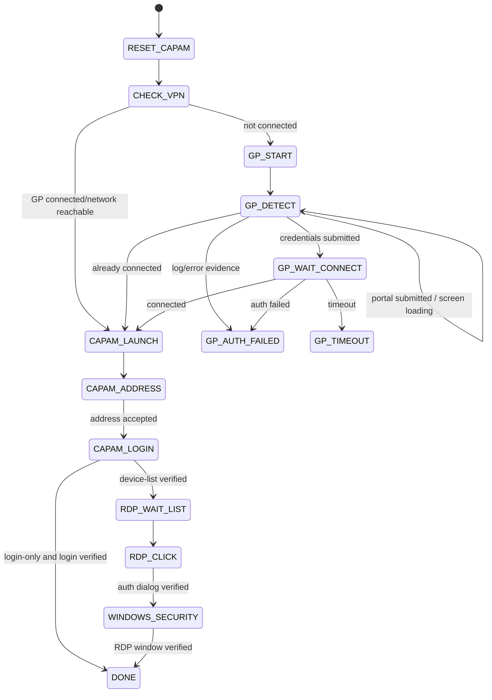

# Ke Hoach Kien Truc Hybrid Windows Automation

## 1. Muc dich tai lieu

Tai lieu nay la baseline de trien khai ban Windows chay on dinh tren Windows 10 va Windows 11, nhieu DPI, do phan giai, font scale, theme va kieu ve control.

Nguyen tac:

- Giu FSM va luong nghiep vu hien co.
- Khong dung mot backend duy nhat cho moi man hinh.
- Semantic/UIA/JAB la evidence tuy chon, khong phai dieu kien bat buoc.
- OCR tim text anchor va state.
- Vision tim hinh hoc, field, icon va button.
- Keyboard dung khi tab order da duoc kiem chung.
- Moi action phai co precondition va postcondition.
- Khong click khi confidence thap hoac target ambiguous.

Day la tai lieu can bam theo khi code. Neu flow nghiep vu doi, cap nhat tai lieu truoc hoac cung commit voi code.

## 2. Ket luan kien truc

Chon pipeline hybrid theo thu tu:

```text
Exact Window/HWND
  -> Capture physical pixels
  -> Normalize frame
  -> Collect evidence in parallel
       - process/window metadata
       - GP log/network state
       - UIA/JAB controls neu co
       - OCR text boxes
       - vision field/button/icon candidates
  -> Fuse evidence into ScreenObservation
  -> Classify state
  -> Resolve target by anchors + geometry
  -> Validate stable frames and foreground
  -> Act once
  -> Validate postcondition
  -> Retry detection or fail safely
```

Khong chon OCR-only. OCR khong biet control nao editable/clickable va van co the doc sai. Khong chon template-only. Template de vo khi font, antialiasing, theme, border radius hoac DPI doi.

## 3. Luong nghiep vu chuan



Khong duoc bo qua postcondition chi vi action da duoc gui.

## 4. Timing va retry baseline

### 4.1 Timing dang co trong code hien tai

| Buoc | Timing hien tai | Quyet dinh |
|---|---:|---|
| Dong CAPAM cu | timeout 5s, poll 0.2s | Giu |
| Nhan dien GP | toi da 60 attempt, khoang 0.5s, tong 30s | Giu tong timeout; doi sang deadline thay vi dem attempt |
| Xac nhan GP state | 2 frame on dinh | Giu |
| Chong submit Portal lap | cooldown 5s | Giu |
| GP wait connected | timeout 25s, log/network poll 0.25s, ping 1s | Giu |
| CAPAM launch | timeout 20s, poll 0.5s | Giu |
| Focus CAPAM | timeout 8s | Giu |
| Address screen | timeout 30s, poll 0.5s, 2 frame | Giu |
| Address postcondition | JAB path 10s | Doi thanh backend-independent 15s |
| Login screen | timeout 30s, poll 0.5s, 2 frame | Giu |
| Login postcondition | JAB path 20s | Giu, them error classification |
| Device List wait | timeout 60s, poll 0.5s | Giu |
| RDP recognition | outer timeout 60s, stop sau 12s rendered miss | Tang rendered miss thanh adaptive 20s khi OCR chua warm-up |
| Focus Device List | timeout 5s | Giu |
| Stable RDP target | 2 frame, tolerance 8px | Doi tolerance theo ty le window, khong pixel co dinh |
| Windows Security wait | timeout 30s, poll 0.5s | Giu |
| Windows Security focus | timeout 5s | Giu |
| RDP success verify | timeout 15s, poll 0.2s | Giu |

### 4.2 Delay policy moi

Khong dung sleep dai co dinh de thay wait condition.

- Poll nhanh `0.2-0.25s`: foreground, HWND ton tai, dialog close, GP log.
- Poll trung binh `0.5s`: OCR/vision state, CAPAM screen transition, window discovery.
- OCR full-frame khong chay moi poll. Cache frame hash va gioi han `1-2 OCR runs/second`.
- Sau focus/restore: doi `0.2-0.3s` cho Java/Windows ve lai frame.
- Sau paste Username vao Java Swing: giu `0.45s` truoc Tab neu dung keyboard fallback.
- Sau Tab CAPAM: giu key-down `0.12s`, doi `0.5s` truoc nhap Password.
- Sau Tab Windows Security: giu toi thieu `0.15s`.
- Sau click submit: khong click lai trong cooldown cua state; chi poll postcondition.

Backoff cho loi capture/OCR tam thoi:

```text
attempt 1-4: 0.5s
attempt 5-8: 0.75s
attempt 9+: 1.0s
```

Deadline cua state van la gioi han cuoi. Backoff khong duoc keo dai deadline.

## 5. Mo hinh du lieu chung

### 5.1 WindowIdentity

```python
@dataclass(frozen=True)
class WindowIdentity:
    hwnd: int
    pid: int
    process_name: str
    title: str
    rect: Rect
    dpi: int
    monitor_id: str
```

Moi toa do detector tra ve la toa do local trong client/window image. Chi chuyen sang screen coordinate ngay truoc click.

### 5.2 NormalizedBox

```python
@dataclass(frozen=True)
class NormalizedBox:
    x: float
    y: float
    w: float
    h: float
```

Gia tri nam trong `0.0..1.0`. Pixel box van duoc luu de render debug, nhung matching/stability dung normalized box.

### 5.3 Evidence

```python
@dataclass
class Evidence:
    source: str          # log, semantic, ocr, contour, template, window
    kind: str            # text, field, button, icon, state, error
    label: str | None
    box: NormalizedBox | None
    confidence: float
    frame_id: str
    metadata: dict
```

### 5.4 ScreenObservation

```python
@dataclass
class ScreenObservation:
    window: WindowIdentity
    frame_id: str
    state: str
    state_confidence: float
    evidence: list[Evidence]
    targets: dict[str, TargetCandidate]
    stable_count: int
```

Handler nhan `ScreenObservation`, khong nhan danh sach contour vo danh nhu hien tai.

## 6. Capture va chuan hoa anh

### 6.1 Capture

Thu tu:

1. Xac nhan exact HWND con ton tai va thuoc dung process.
2. Lay client rect/extended frame rect trong physical pixels.
3. Focus exact HWND neu app Java capture blank khi bi che.
4. Capture exact HWND vao memory.
5. Neu capture blank (`std < 3`), refresh window va retry.
6. Chi fallback desktop crop khi target foreground va rect vua duoc doc lai.

Khong resize anh capture ve kich thuoc logical cua `pygetwindow` neu viec resize lam mat text. Toa do phai dong bo theo physical-pixel capture.

### 6.2 Frame normalization

Tao cac bien the tu mot frame:

- BGR goc cho template mau.
- Grayscale cho contour/template.
- CLAHE grayscale cho contrast thap.
- Adaptive threshold cho text/field border.
- Inverted threshold cho dark theme.
- Scale-up `1.5x-2x` chi cho OCR text nho.

Khong ep tat ca detector dung cung mot preprocessed image.

### 6.3 Frame cache

- Hash anh downscaled de phat hien frame khong doi.
- Neu frame khong doi, tai su dung OCR result.
- Vision nhe co the chay moi poll.
- OCR chi chay lai khi frame delta du nguong, state timeout gan het, hoac target chua du confidence.

## 7. OCR backend

### 7.1 Lua chon de spike

Thu tu danh gia:

1. Windows.Media.Ocr: nhe, co san tren Windows 10/11, packaging nho, can test WinRT trong PyInstaller.
2. RapidOCR/ONNX Runtime: offline, de bundle hon PaddleOCR full, model chu Latin nho.
3. Tesseract: chi fallback neu chap nhan bundle binary va traineddata.

Khong dua EasyOCR/PyTorch vao production truoc vi EXE lon, startup cham va packaging phuc tap.

Quyet dinh backend sau benchmark, khong dua theo cam giac.

### 7.2 OCR normalization

- Unicode normalize.
- Trim whitespace va punctuation cuoi label.
- Lowercase de match.
- Map confusion co gioi han: `0/O`, `1/l/I`, chi voi token co format biet truoc nhu IP/device ID.
- Fuzzy matching dung normalized edit distance.
- Khong fuzzy match credential value.

Alias dictionary ban dau:

```text
portal: portal, portal address
username: username, user name
password: password
connect: connect
login: login, sign in
address: address
rdp: rdp, remote desktop
device 200: 200, 211.200
device 12: 12, 211.12
windows security: windows security
```

### 7.3 OCR confidence

OCR text chi thanh anchor khi:

- engine confidence dat nguong; va
- fuzzy text score dat nguong; va
- box nam trong ROI hop ly cua state; va
- khong co anchor cung label thu hai co score gan bang.

Vi du:

```text
anchor_score = 0.50 * engine_confidence
             + 0.30 * text_similarity
             + 0.20 * region_prior
```

Nguong ban dau `>= 0.72`. Can calibration bang screenshot that.

## 8. Vision backend

### 8.1 Field detector moi

Khong phu thuoc border tron hay vuong. Tao candidate tu nhieu signal:

- contour/Canny tren grayscale va CLAHE.
- connected components tren adaptive threshold.
- horizontal/vertical line morphology.
- filled rectangular region co contrast voi nen.
- semantic bounds neu UIA/JAB co.

Field score:

```text
field_score = 0.25 * width_prior
            + 0.15 * height_prior
            + 0.20 * rectangularity
            + 0.15 * interior_uniformity
            + 0.15 * anchor_alignment
            + 0.10 * semantic_support
```

Khong yeu cau contour dong kin. Rounded corner van co line/contrast/interior evidence.

### 8.2 Button detector

Button candidate tu:

- OCR text box nhu `Connect`, `Login`, `RDP`.
- region background/edge xung quanh text.
- template/icon match neu co.
- same-row/same-column relation.
- semantic role button neu co.

Neu OCR doc text nam trong vung button, click tam cua expanded visual region; khong click tam glyph nho neu box text sat vien.

### 8.3 Template matcher moi

Giu multi-scale matcher, nhung giam phu thuoc template font:

- Template icon/button chi nen crop phan icon/shape on dinh.
- Device label uu tien OCR; template label la evidence phu.
- Scale range dua tren actual window DPI truoc, fallback scan rong sau.
- Them edge-template mode de giam anh huong color/theme.
- Khong early-break chi vi mot scale `>= 0.78` neu co nhieu target cung loai.
- Dung non-maximum suppression de lay tat ca RDP candidates.

### 8.4 Object detection

Chua huan luyen model object detection trong phase dau.

Chi xem xet YOLO/ONNX khi:

- Da co it nhat 300-500 anh gan nhan moi control class.
- Anh bao gom Win10/11, DPI 100/125/150/175, font scale, theme, monitor phu.
- Hybrid OCR/geometry van khong dat acceptance rate.

Model khong tu dong giai quyet domain shift neu training data it.

## 9. Evidence fusion va confidence

### 9.1 Khong cong score mu

Moi state co rule rieng. Evidence doc lap moi duoc cong diem. Vi du contour va edge-template cung sinh tu mot border, khong coi la hai evidence doc lap hoan toan.

### 9.2 Target confidence

Mau ban dau:

```text
target_score = 0.30 * anchor_score
             + 0.25 * geometry_score
             + 0.20 * visual_score
             + 0.15 * semantic_score
             + 0.10 * temporal_stability
```

Backend thieu thi redistribute weight theo profile cua state, khong gan score 0 lam ha target dung.

Muc action:

- `>= 0.82`: cho phep action neu target unique va stable.
- `0.70..0.82`: thu them frame/backend, khong action.
- `< 0.70`: reject.
- Top-1 va Top-2 cach nhau `< 0.10`: ambiguous, reject.

### 9.3 Temporal stability

Dung normalized center/size:

```text
center delta <= 0.01 * min(window_width, window_height)
size delta <= 5%
same exact HWND
same classified state
```

Can 2 frame on dinh. Neu score gan nguong hoac OCR confidence thap, can 3 frame.

## 10. Luong chi tiet tung state

### 10.1 RESET_CAPAM

Precondition:

- Workflow moi bat dau.

Action:

1. Tim CAPAM exact title/process.
2. Neu khong co, sang `CHECK_VPN` ngay.
3. Neu co, kill process so huu exact HWND.
4. Poll moi `0.2s`, timeout `5s`.

Postcondition:

- Exact HWND/process cu khong con.

Khong kill tat ca `java.exe`.

### 10.2 CHECK_VPN

Evidence:

- GP log recent connected state.
- TCP CAPAM 443 timeout `0.5s`.
- Ping fallback.

Decision:

- Log connected: `CAPAM_LAUNCH`.
- Network reachable: `CAPAM_LAUNCH`.
- Con lai: `GP_START`.

Khong dung OCR o state nay.

### 10.3 GP_START

Action:

1. Ghi GP log offset.
2. Launch/activate `PanGPA.exe`.
3. Chuyen sang `GP_DETECT`, khong sleep dai.

### 10.4 GP_DETECT

Window contract:

- Exact title `GlobalProtect`.
- Process phai la GP process hop le.
- Exact HWND duoc giu trong transaction.

Evidence Portal:

- GP log state Portal.
- OCR anchor `Portal` hoac portal URL.
- Mot field candidate trong lower/middle ROI.
- Semantic `Edit Name=Portal` neu co.

Evidence Credentials:

- GP log user credential.
- OCR `Username`/`Password`.
- Hai field candidates sap theo Y.
- Semantic HelpText neu co.

State classification:

- Log la evidence manh nhung khong du de type vao stale screen.
- Can it nhat mot visual/semantic confirmation cho Portal/Credentials.
- `CONNECTED` va `AUTH_FAILED` tu log co the ket thuc state khong can field.
- Can 2 frame on dinh, poll `0.5s`, timeout tong `30s`.

Portal target resolver:

1. Semantic field unique neu co.
2. Field gan OCR anchor `Portal` nhat, uu tien right/below anchor.
3. Vision field unique trong profile ROI.
4. Ratio coordinate chi duoc fallback khi screen state confidence cao va layout fingerprint match calibration.

Portal action:

1. Validate foreground + unchanged HWND/size.
2. Click/focus field.
3. `Ctrl+A`, `Backspace`, nhap URL.
4. Submit bang semantic button, OCR button, hoac Enter trong field.
5. Bat cooldown `5s`; khong submit lap trong cooldown.

Portal postcondition:

- Credentials observation xuat hien; hoac
- GP log chuyen state; hoac
- error observation.

Credentials resolver:

1. Tim Username va Password theo anchor-label relation.
2. Neu label khong doc duoc, dung hai field unique sap theo Y va layout fingerprint.
3. Neu chi tim duoc Username nhung tab order da calibration, cho phep keyboard fallback.
4. Neu co hon hai candidate ma khong resolve unique, fail detect; khong click.

Credentials action:

1. Focus/click Username, clear, nhap username.
2. Focus/click Password, clear, nhap `password_prefix + otp`.
3. Ghi log offset ngay truoc submit.
4. Submit mot lan.
5. Chuyen ngay `GP_WAIT_CONNECT`.

Khong retry nhap credentials trong `GP_DETECT` sau khi submit thanh cong.

### 10.5 GP_WAIT_CONNECT

Giu logic hien tai:

- Timeout `25s`.
- Poll log/network moi `0.25s`.
- Ping toi da moi `1s`.
- `AUTH_FAILED` fail ngay.
- `CONNECTED` sang CAPAM.
- Browser callback chi minimize neu browser dang foreground va user bat option.

OCR chi dung de thu thap error text neu log khong co, khong thay log parser.

### 10.6 CAPAM_LAUNCH

Action:

1. Tim CAPAM executable bang candidate path + registry.
2. Launch voi clean Java/PyInstaller environment.
3. Poll exact main window moi `0.5s`, timeout `20s`.
4. Capture frame va cho frame khong blank.

Postcondition:

- Exact CAPAM main HWND visible.

### 10.7 CAPAM_ADDRESS

State evidence:

- OCR anchor `Address`, `Connect Mode`, `Connect`.
- Field/combo candidate gan `Address`.
- Semantic/JAB label/control neu co, ke ca chi co mot phan.
- Window aspect ratio chi la prior nhe, khong la gate `<0.55`.

Target resolver:

1. Tim OCR `Address` label.
2. Tim field candidate ben phai hoac ben duoi label trong khoang normalized.
3. Neu semantic co bounds cua `Address`, dung lam candidate hoac evidence, khong bat buoc action JAB.
4. Neu OCR fail, dung visual layout fingerprint + field geometry.
5. Neu chi co mot field candidate hop le, cho phep chon voi confidence cao hon threshold.

Action strategy:

1. Semantic set/invoke neu control action da qua health check trong run nay.
2. Semantic focus + keyboard neu chi focus duoc.
3. Hybrid click field + keyboard.
4. Enter trong Address field uu tien hon click button neu button ambiguous.

Postcondition, timeout `15s`, poll `0.5s`:

- CAPAM Login observation co Username + Password evidence; hoac
- Address screen bien mat va login layout xuat hien; hoac
- OCR/semantic error message.

Neu da type/submit thi khong fallback sang backend khac trong cung transaction. Chi retry tu state neu postcondition xac nhan van o Address va field value/action an toan de lap.

### 10.8 CAPAM_LOGIN

State evidence:

- OCR anchors `Username`, `Password`, `Authentication Type`, `Login`.
- Field candidates gan Username/Password.
- Semantic/JAB controls neu co mot phan.
- Window ratio chi la prior nhe, khong gate `>=0.55`.

Quan trong:

- Khong nham `Password` voi `Passcode (PIN+Tokencode)` hoac `RADIUS Password`.
- Resolver dung exact/fuzzy label + vertical relation + field type neu semantic co.
- CAPAM password nghiep vu phai duoc xac nhan: `password_prefix` hay `password_prefix + otp`. Khong hardcode tiep khi chua chot.

Target resolver:

1. Resolve Username field tu OCR label + geometry.
2. Resolve Password field tu exact `Password`, loai anchor co `Passcode`/`RADIUS`.
3. Neu Password border khong detect vi bullet/value, dung tab relation tu Username sau khi Username duoc resolve chac chan.
4. Resolve Login button tu OCR/semantic; Enter chi khi focus dang o Password.

Action:

1. Exact HWND foreground.
2. Clear va nhap Username.
3. Neu click Password unique, click; neu khong, doi `0.45s`, Tab key-down `0.12s`, doi `0.5s`.
4. Clear va nhap Password.
5. Submit mot lan.

Postcondition, timeout `20s`:

- Device List exact title xuat hien; hoac
- login-only co evidence login thanh cong; hoac
- OCR/semantic auth error; hoac
- timeout.

`server_choice=none` khong duoc tra `DONE` ngay sau Enter. Phai xac minh Login screen da bien mat hoac Device List/main authenticated state da xuat hien.

### 10.9 RDP_WAIT_LIST

Window contract:

- Exact title `Symantec Privileged Access Manager Client - <CAPAM_IP>`.
- Exact HWND/PID duoc giu cho state sau.
- Poll `0.5s`, timeout `60s`.

Postcondition:

- Frame da render, `std >= 3` va on dinh.

### 10.10 RDP_CLICK

Device row resolver:

1. OCR full Device List hoac ROI danh sach de tim `211.200`/`200` hoac `211.12`/`12`.
2. Validate token theo boundary, khong match `12` nam trong IP/so khac.
3. Template device label la evidence phu.
4. Neu OCR va template cung dong y row, tang confidence.
5. Neu mau thuan row, reject va retry.

RDP target resolver:

1. OCR `RDP` neu button co text.
2. Multi-scale template/icon candidates.
3. Button geometry candidates.
4. Chi lay candidate cung row voi device anchor.
5. Row tolerance dung ty le chieu cao row/window, khong `45px` co dinh.
6. Chon unique candidate co score cao nhat, top gap `>=0.10`.

Stability:

- Frame delta phai nho.
- Target stable 2 frame; 3 frame neu score gan nguong.
- Exact HWND/rect khong doi.
- Foreground check ngay truoc click.

Retry:

- Poll `0.5s`, timeout outer `60s`.
- Sau 2 miss: refresh exact window.
- Sau 4 miss: focus lai + refresh.
- Rendered miss timeout `20s` khi OCR backend dang warm-up; `12s` neu OCR cache da san sang.

Postcondition:

- Windows Security/CAPAM auth dialog xuat hien trong timeout.

Neu khong co dialog sau click, khong click lai ngay. Doi va classify scene; click lai chi khi Device List van active, target van unique, va cooldown da het.

### 10.11 WINDOWS_SECURITY

Primary path giu keyboard:

1. Snapshot cac RDP windows truoc khi doi dialog.
2. Wait exact CAPAM auth dialog hoac `Windows Security`, timeout `30s`.
3. Focus exact HWND, timeout `5s`.
4. Validate rect/HWND unchanged.
5. Neu default focus behavior da calibration cho dialog fingerprint nay, type Username.
6. Tab mot lan, doi `0.15s`, type Password.
7. Enter mot lan.
8. Poll `0.2s`, timeout `15s`.

OCR role:

- Xac nhan title/text `Windows Security`, `Username`, `Password` neu capture duoc.
- Phat hien error/retry dialog.
- Khong bat buoc neu secure/custom dialog khong capture child text.

Postcondition:

- Submitted dialog dong; va
- mstsc window moi hoac mstsc title/state thay doi; va
- khong co replacement credential dialog.

Khong retry credential mu neu dialog xuat hien lai.

## 11. Layout fingerprint

Ratio coordinate fallback chi duoc dung khi frame match mot layout family da calibration.

Fingerprint gom:

- window aspect ratio range.
- normalized anchor positions.
- so field/button candidates.
- khoang cach giua labels/fields.
- theme brightness histogram.
- optional perceptual hash cua cac vung khong chua credential.

Moi layout family co version:

```text
gp-portal-win10-v1
gp-portal-win11-v1
gp-login-win10-v1
capam-address-java17-v1
capam-login-java17-v1
device-list-java17-v1
```

Khong tao profile theo do phan giai. Vi tri luu normalized, DPI chi la metadata.

## 12. Cau truc module de xuat

```text
automation/
  java_access_bridge.py       # optional semantic evidence/action
  windows_uia.py              # optional semantic evidence/action
  keyboard.py                 # guarded keyboard transaction
  errors.py                   # typed error categories

capture/
  window_capture.py           # physical-pixel HWND capture
  frame.py                    # frame variants, hash, cache

ocr/
  base.py                     # OCR interface
  windows_ocr.py              # Windows.Media.Ocr spike
  rapidocr_backend.py         # optional ONNX backend
  text_matcher.py             # aliases, fuzzy matching, token rules

vision/
  field_detector.py           # multi-signal geometry detector
  button_detector.py          # OCR box + visual region resolver
  template_matcher.py         # multi-scale/icon matching
  layout.py                   # normalized geometry and fingerprints

recognition/
  models.py                   # Evidence, Observation, Candidate
  fusion.py                   # confidence and ambiguity rules
  gp_recognizer.py
  capam_recognizer.py
  device_list_recognizer.py
  windows_security_recognizer.py

core/
  gp_handler.py               # state actions/postconditions
  capam_handler.py
  rdp_handler.py
  state_machine.py
```

Khong can tao het module ngay. Phase dau co the giu `capture`/`recognition` trong it file, tach khi API on dinh.

## 13. API handler muc tieu

```python
class GPRecognizer:
    def observe(self, window, frame) -> ScreenObservation: ...

class CAPAMRecognizer:
    def observe_address(self, window, frame) -> ScreenObservation: ...
    def observe_login(self, window, frame) -> ScreenObservation: ...

class DeviceListRecognizer:
    def locate_rdp(self, window, frame, device_choice) -> ScreenObservation: ...

class GuardedAction:
    def fill_text(self, window, target, value): ...
    def click(self, window, target): ...
    def press(self, window, key): ...
```

FSM khong goi OCR/OpenCV/JAB truc tiep. Handler lay observation, chon action strategy, roi wait postcondition.

## 14. Fallback transaction policy

Cho phep fallback truoc khi action:

- Semantic khong co: OCR + vision.
- OCR khong doc duoc label: vision + layout fingerprint.
- Vision khong thay border: OCR anchor + semantic bounds hoac keyboard relation.
- Template label fail: OCR device token.
- OCR RDP fail: icon/template same-row.

Khong fallback sau partial action:

- Da nhap Username nhung khong chac focus Password.
- Da submit credentials.
- HWND/rect/foreground doi trong luc type.
- Target ambiguous.
- Postcondition bao auth fail.

Trong truong hop tren, fail state co diagnostic. Khong thu backend khac de type lap.

## 15. Diagnostic va bao mat

Moi run tao mot diagnostic session ID.

Log:

- Windows version/build.
- DPI awareness context, monitor DPI, scale.
- Window title, HWND, PID, process name, rect.
- State, backend evidence, confidence, target score.
- Retry count, elapsed, timeout category.
- Frame hash va layout fingerprint.

Artifact chi luu khi diagnostics bat:

- Anh truoc khi credential duoc nhap.
- Anh debug co boxes/labels/confidence.
- OCR text da redact.

Khong luu:

- Password, OTP, clipboard content.
- Screenshot co password hien ro.
- Accessible value cua password field.

## 16. Ke hoach trien khai

### Phase 0: Dong baseline

1. Chot flow nghiep vu GP/CAPAM/RDP.
2. Xac nhan CAPAM password co cong OTP hay khong.
3. Thu thap screenshot fail Win10 va Win11 truoc action, khong chua secret.
4. Ghi Windows build, DPI, font scale, resolution, CAPAM/GP version.
5. Chay baseline 20 lan moi may, ghi success theo state.

Output:

- Dataset calibration co metadata.
- Bao cao state nao fail, khong chi success/fail toan flow.

### Phase 1: Capture va normalized geometry

1. Sua capture de physical pixels va exact HWND.
2. Them `WindowIdentity`, normalized box, frame hash/cache.
3. Doi stable tolerance `8px`, row tolerance `45px` sang normalized thresholds.
4. Giu detector cu de so sanh.

Acceptance:

- Cung control cho normalized box gan nhau tren 100/125/150%.
- Screen-to-window coordinate click dung tren Win10/11 va monitor phu.

### Phase 2: OCR spike va benchmark

1. Implement OCR interface.
2. Spike Windows.Media.Ocr va RapidOCR.
3. Benchmark cold start, warm latency, accuracy, EXE size.
4. Chon mot backend production va mot optional fallback neu can.
5. Them alias/fuzzy/token matcher.

Acceptance:

- Doc dung cac anchor nghiep vu >= 98% tren dataset calibration.
- Warm OCR ROI <= 500ms tren may yeu nhat du kien.
- Khong can internet.

### Phase 3: Hybrid GP recognizer

1. Ket hop log + OCR + field geometry + optional UIA.
2. Bo rule chi dem `1 field`/`2 field` lam state duy nhat.
3. Them target confidence va ambiguity rejection.
4. Giu cooldown/retry/postcondition hien tai.

Acceptance:

- GP Portal/Credentials chay Win10/11, DPI 100/125/150.
- Khong type theo stale log state.
- Sai OTP fail tu log, khong resubmit lap.

### Phase 4: Hybrid CAPAM Address/Login

1. Doi JAB thanh optional evidence/action.
2. Them OCR anchors va multi-signal field detector.
3. Bo aspect ratio gate cung `<0.55`/`>=0.55`.
4. Them backend-independent postcondition.
5. Sua login-only khong DONE truoc verify.

Acceptance:

- Chay du khi JAB chi expose label/name mot phan.
- Chay du khi field border tron/vuong, light/dark-ish theme.
- Khong nham Password voi Passcode/RADIUS.

### Phase 5: Hybrid Device List

1. OCR tim device row.
2. Vision/template tim tat ca RDP candidates.
3. Same-row resolver theo normalized geometry.
4. Them top-gap ambiguity check va click cooldown.
5. Giu stable frame, exact HWND, foreground guard.

Acceptance:

- Device row accuracy 100% tren dataset.
- Khong click row sai trong test co nhieu RDP button.
- Chay Win10/11, DPI 100/125/150/175 neu co.

### Phase 6: Windows Security hardening

1. Giu keyboard primary.
2. Them dialog fingerprint va optional OCR confirmation.
3. Them error/replacement dialog classification.
4. Khong retry credential mu.

Acceptance:

- Credential sai khong bao DONE.
- Focus bi cuop thi fail truoc khi type tiep.

### Phase 7: Packaging

1. Build `onedir` truoc de debug OCR/JAB DLL/model.
2. Test tren may sach khong Python/JDK system.
3. Sau khi `onedir` pass moi build `onefile`.
4. Kiem tra cold-start OCR model extraction va antivirus behavior.
5. Khong bundle `AccessibilityInsights.msi` vao san pham.

## 17. Test matrix bat buoc

OS:

- Windows 10 may hien tai.
- Windows 11 may dang fail.
- It nhat mot Windows 11 build khac neu co.

Display:

- 1366x768, 1920x1080, resolution thuc te dang dung.
- DPI 100%, 125%, 150%; 175% neu nguoi dung co.
- Font/text scale 100%, 125% neu Windows cho cau hinh rieng.
- Primary va secondary monitor.
- Window bi di chuyen, minimize/restore, bi che roi focus lai.

Theme/render:

- Light/dark Windows theme neu GP/CAPAM bi anh huong.
- Rounded/non-rounded control variants tu Win10/11.
- CAPAM/GP version tren hai may.

Flow:

- VPN connected san.
- GP Portal -> Credentials -> Connected.
- GP dang o Credentials ngay khi bat dau.
- Sai password/OTP.
- GP timeout.
- CAPAM Address co gia tri cu.
- CAPAM Login co Password/Passcode/RADIUS controls.
- Login-only.
- Device 200 va 12.
- Device List load cham/dang repaint.
- Windows Security success/fail/reappear.
- User/browser/notification cuop focus.

## 18. Chi so nghiem thu

Khong the dam bao tuyet doi "moi man hinh" neu khong co test data. Muc tieu do duoc:

- 50 run lien tiep moi may test, khong click/type sai target.
- State detection >= 99% tren calibration dataset.
- Target precision uu tien 100%; low recall duoc phep retry/fail an toan.
- Khong false-positive click RDP sai row.
- Khong resubmit credential sau auth fail.
- Khong bao DONE khi postcondition chua dat.
- Moi failure co state, category, backend scores va diagnostic artifact an toan.

## 19. Viec can lam ngay

Thu tu code de tranh thay doi qua lon:

1. Xac nhan quy tac password CAPAM.
2. Thu thap bo screenshot Win10 pass va Win11 fail co metadata DPI/font/app version.
3. Sua capture/coordinate thanh physical pixel + normalized geometry.
4. Tao OCR spike va benchmark tren bo anh.
5. Lam Hybrid Device List truoc neu day la state dang fail tren Win11.
6. Lam GP recognizer.
7. Lam CAPAM Address/Login recognizer.
8. Hardening postcondition va packaging.

Khong them OCR vao moi handler cung luc. Moi phase giu regression test cua flow cu va feature flag de so sanh.

Feature flags tam:

```text
AUTOMATION_HYBRID_ENABLED=false
AUTOMATION_OCR_BACKEND=windows
AUTOMATION_ALLOW_SEMANTIC=true
AUTOMATION_ALLOW_RATIO_FALLBACK=false
AUTOMATION_DIAGNOSTICS=false
```

Khi hybrid dat acceptance tren ca hai may, doi default va sau do moi xoa fallback cu khong con can.

## 20. Trang thai trien khai

Phase 1 da co implementation ban dau:

- Them `capture/` voi exact-HWND `FrameCapture` va `FrameSnapshot`.
- Frame co fingerprint, blank-frame check va mean-delta cache.
- Them `recognition/geometry.py` voi normalized boxes/points.
- CAPAM field stability khong con dung tolerance `8px` co dinh.
- RDP target stability dung normalized point tolerance.
- RDP click map toa do anh capture sang screen rect, xu ly truong hop physical image size khac logical/window rect.
- Windows HWND capture khong resize anh truoc recognition, tranh mat text/icon.
- Build scripts da include `capture` va `recognition` packages.
- Unit tests offline bao phu geometry, frame va capture contract.

Chua xac minh:

- Physical-pixel coordinate mapping tren Windows 10/11 that.
- Mixed-DPI multi-monitor.
- OCR backend va anchor accuracy.
- Device List regression voi screenshot Win11 dang fail.

Phase tiep theo chi bat dau sau khi co screenshot/metadata Win10 pass va Win11 fail, hoac co may Windows de chay capture diagnostics.
