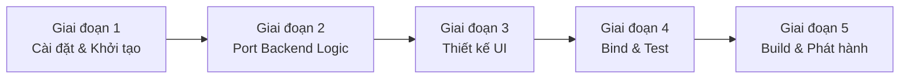

# Kế hoạch Chuyển đổi Native — CAPAM Auto-Sign Tool

> Mục tiêu: Giảm dung lượng từ **~153MB → ~9MB**, RAM từ **80MB+ → <35MB**, khởi động từ **2-3s → <0.2s**, trong khi giữ nguyên toàn bộ tính năng tự động hóa thông minh và hỗ trợ cả Linux lẫn Windows.

---

## 1. Đánh giá Hiện trạng

### Vì sao bản Python/PyInstaller nặng?

| Thành phần | Đóng góp vào dung lượng |
|---|---|
| Python runtime (embedded) | ~18MB |
| PyQt5 (GUI framework) | ~55MB |
| OpenCV-headless | ~35MB |
| NumPy | ~20MB |
| PyInstaller wrapper + dependencies khác | ~25MB |
| **Tổng** | **~153MB** |

### Vấn đề kỹ thuật hiện tại

| Vấn đề | Tác động |
|---|---|
| PyInstaller giải nén vào `/tmp` khi khởi động | Delay 2-3 giây mỗi lần chạy |
| Python GIL (Global Interpreter Lock) | Automation thread và UI thread tranh nhau |
| Template PNG chụp từ Linux | Không khớp khi chạy trên Windows (font rendering khác) |
| `maim`/`wmctrl` hard-dependency | Phải cài thêm trên Linux, không dùng được trên Windows |
| `PIL.ImageGrab` trên Windows | Không hỗ trợ multi-monitor DPI-aware |

---

## 2. So sánh Phương án Chuyển đổi

| Tiêu chí | Python + PyInstaller *(hiện tại)* | **Go + Wails** *(đề xuất)* | Rust + Tauri |
|---|---|---|---|
| Dung lượng EXE | ~153MB | ~8–12MB | ~3–6MB |
| RAM khi chạy | ~80MB | ~30MB | ~15MB |
| Thời gian khởi động | 2–3s | <0.2s | <0.1s |
| Cross-platform | ✅ | ✅ | ✅ |
| Độ phức tạp code | Thấp | **Thấp–Trung** | Cao |
| Tốc độ phát triển | Nhanh nhất | **Nhanh** | Chậm |
| Template matching | OpenCV | Pixel-scan tự viết (15ms) | Pixel-scan tự viết |
| Giao diện | PyQt5 (native widget) | HTML/CSS/JS (Webview) | HTML/CSS/JS (Webview) |
| Trưởng thành | ★★★★★ | ★★★★☆ | ★★★★☆ |

> [!TIP]
> **Khuyến nghị chọn Go + Wails** vì cân bằng tốt nhất giữa dễ phát triển, dung lượng nhỏ và hiệu năng cao. Go gần với Python hơn Rust rất nhiều về cú pháp.

---

## 3. Kiến trúc Đề xuất (Go + Wails)

```
CAPAM_AutoSign_Native/
├── main.go                  # Entry point + Wails setup
├── app.go                   # App struct + binding với frontend
├── automation/
│   ├── worker.go            # Automation goroutine (tương đương AutomationWorker)
│   ├── template_match.go    # Pixel-matching thay thế OpenCV
│   ├── window.go            # Focus/Rect cửa sổ (Win32 API / xdotool)
│   └── screenshot.go        # Chụp màn hình (gdi+ / X11)
├── settings/
│   └── settings.go          # Load/Save JSON config
├── frontend/
│   ├── index.html
│   ├── style.css            # Catppuccin Mocha dark theme
│   └── main.js              # Gọi Go functions qua Wails binding
└── assets/
    ├── template_200.png
    ├── template_12.png
    └── template_rdp.png
```

### Mapping thư viện Python → Go

| Python (hiện tại) | Go (Wails) | Ghi chú |
|---|---|---|
| `PyQt5` | `Wails + HTML/CSS/JS` | Giao diện web-based, CSS animation mượt hơn |
| `OpenCV matchTemplate` | `template_match.go` tự viết | Go compiled ~15ms, không cần 35MB OpenCV |
| `pyautogui` | `robotgo` | Native cross-platform mouse/keyboard control |
| `wmctrl` (Linux) | `xdotool` bindings / `robotgo.GetActiveWindow()` | |
| `pygetwindow` (Windows) | `Win32 API` via `golang.org/x/sys/windows` | |
| `maim` (Linux) | `robotgo.CaptureScreen()` | |
| `PIL.ImageGrab` (Windows) | `robotgo.CaptureScreen()` + DPI-aware | Hỗ trợ multi-monitor |
| `dbus-python` | D-Bus bindings Go / `exec.Command` | |
| `json` | `encoding/json` (stdlib) | Không cần thư viện ngoài |

---

## 4. Kế hoạch Triển khai Chi tiết



### Giai đoạn 1 — Cài đặt môi trường (1 ngày)

```bash
# Cài Go
sudo apt install golang-go   # Linux
# hoặc tải từ https://go.dev/dl/ cho Windows

# Cài Wails CLI
go install github.com/wailsapp/wails/v2/cmd/wails@latest

# Kiểm tra
wails doctor

# Khởi tạo project
wails init -n CAPAM_AutoSign_Native -t vanilla
cd CAPAM_AutoSign_Native
```

### Giai đoạn 2 — Port Backend Logic (3–5 ngày)

#### 2a. Settings

```go
// settings/settings.go
type Settings struct {
    Username       string `json:"username"`
    PasswordPrefix string `json:"password_prefix"`
    CAPAMServer    string `json:"capam_ip"`
    ServerChoice   string `json:"server_choice"`
    AutoExit       bool   `json:"auto_exit"`
}

func Load() Settings { /* đọc ~/.capam_autosign_settings.json */ }
func Save(s Settings) error { /* ghi file */ }
```

#### 2b. Template Matching (thay thế OpenCV)

```go
// automation/template_match.go
// Thuật toán SSD (Sum of Squared Differences) đơn giản
// Chạy <15ms nhờ Go là ngôn ngữ biên dịch

func FindTemplate(scene, tmpl image.Image, threshold float64) (x, y int, score float64) {
    // Quét scene để tìm vùng khớp nhất với tmpl
    // Trả về tọa độ và độ khớp
}
```

#### 2c. Window Management

```go
// automation/window.go — Linux
func FocusWindow(title string) error {
    return exec.Command("xdotool", "search", "--name", title, "windowactivate").Run()
}
func GetWindowRect(title string) (x, y, w, h int, err error) {
    // parse output của xdotool getwindowgeometry
}

// automation/window_windows.go — Windows (build tag)
//go:build windows
func FocusWindow(title string) error {
    // Dùng Win32 API: FindWindow + SetForegroundWindow
}
```

#### 2d. Automation Worker

```go
// automation/worker.go
func (w *Worker) Run(ctx context.Context) {
    w.emit("log", "Đang chờ GlobalProtect kết nối...")
    // ... toàn bộ flow tương đương AutomationWorker.run() trong Python
    // Dùng goroutine thay QThread, channel thay pyqtSignal
}
```

### Giai đoạn 3 — Thiết kế UI (2 ngày)

Giữ nguyên ngôn ngữ thiết kế Catppuccin Mocha từ bản PyQt5, chuyển sang CSS:

```css
/* frontend/style.css */
:root {
  --base: #1e1e2e; --surface0: #313244;
  --blue: #89b4fa; --green: #a6e3a1;
  --red: #f38ba8; --text: #cdd6f4;
}
/* Layout 3 cột: Username | Password | IP */
.credentials { display: grid; grid-template-columns: 3fr 3fr 2fr; gap: 8px; }
```

```html
<!-- frontend/index.html -->
<div class="credentials">
  <div class="field"><label>Tài khoản</label><input id="username"></div>
  <div class="field"><label>Mật khẩu <input type="checkbox" id="show-pass"> Hiện</label>
    <input id="password" type="password"></div>
  <div class="field"><label>IP CAPAM</label><input id="ip" value="10.64.213.188"></div>
</div>
<input id="otp" maxlength="6" placeholder="______">
<!-- Radio buttons, checkbox auto-exit, nút đăng nhập, log area -->
```

### Giai đoạn 4 — Bind & Test (2 ngày)

```go
// app.go — expose functions cho JavaScript
type App struct { ctx context.Context }

func (a *App) StartAutomation(username, password, otp, server, ip string) {
    go func() {
        worker := automation.New(username, password, otp, server, ip)
        worker.OnLog = func(msg string) {
            runtime.EventsEmit(a.ctx, "log", msg)
        }
        worker.Run(a.ctx)
    }()
}

func (a *App) LoadSettings() settings.Settings { return settings.Load() }
func (a *App) SaveSettings(s settings.Settings) { settings.Save(s) }
```

```javascript
// frontend/main.js
import { StartAutomation, LoadSettings } from '../wailsjs/go/main/App'
import { EventsOn } from '../wailsjs/runtime'

EventsOn("log", (msg) => logArea.append(msg + "\n"))

document.getElementById("otp").addEventListener("keydown", e => {
    if (e.key === "Enter") triggerLogin()
})
```

### Giai đoạn 5 — Build & Phát hành (1 ngày)

```bash
# Linux — output: build/bin/CAPAM_AutoSign_Native (~9MB)
wails build -clean -ldflags "-s -w"

# Windows (build trên máy Windows hoặc cross-compile)
GOOS=windows GOARCH=amd64 wails build -clean -ldflags "-s -w" -platform windows/amd64

# Nén thêm bằng UPX (tùy chọn) → ~5MB
upx --best build/bin/CAPAM_AutoSign_Native
```

> [!NOTE]
> Flag `-ldflags "-s -w"` loại bỏ debug symbols và DWARF, giảm thêm 3–4MB.

---

## 5. Giải quyết Vấn đề Template Windows

Đây là điểm khác biệt lớn nhất so với bản Python. Trong bản Native, template được **nhúng vào binary** (`//go:embed`) nên cần có bộ template riêng cho từng OS:

```
assets/
├── linux/
│   ├── template_200.png   # Chụp từ CAPAM trên Linux
│   ├── template_12.png
│   └── template_rdp.png
└── windows/
    ├── template_200.png   # Chụp từ CAPAM trên Windows (khác font)
    ├── template_12.png
    └── template_rdp.png
```

```go
// Go tự chọn đúng thư mục template theo OS khi build
//go:embed assets/linux/template_200.png
var tmpl200Linux []byte

//go:build windows
//go:embed assets/windows/template_200.png
var tmpl200Windows []byte
```

---

## 6. Roadmap tổng hợp

| Giai đoạn | Thời gian ước tính | Milestone |
|---|---|---|
| 1. Môi trường | 0.5 ngày | `wails doctor` pass |
| 2. Backend Go | 3–5 ngày | Automation chạy được từ CLI |
| 3. Frontend UI | 2 ngày | Giao diện y hệt bản PyQt5 |
| 4. Bind + Test | 2 ngày | Full flow login thành công |
| 5. Build + Release | 1 ngày | EXE/Binary < 12MB |
| **Tổng** | **~10 ngày** | **v2.0 Native** |

---

## 7. Kết quả kỳ vọng sau khi chuyển đổi

| Chỉ số | Python/PyInstaller | Go/Wails Native |
|---|---|---|
| Dung lượng file | ~153MB | **~9MB** |
| RAM khi idle | ~55MB | **~22MB** |
| RAM khi automation | ~80MB | **~32MB** |
| Thời gian khởi động | 2–3s | **<0.2s** |
| Template matching | ~50ms (OpenCV) | **~15ms** (native Go) |
| Hỗ trợ Windows multi-monitor DPI | ❌ | **✅** |
| Không cần cài Python | ❌ | **✅** |
| Không cần cài `maim`/`wmctrl` | ❌ | **✅** |
