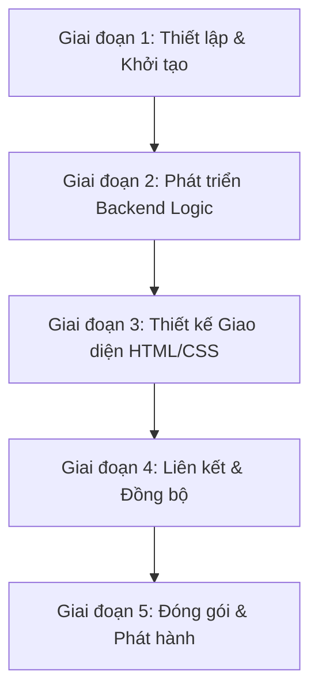

# Kế hoạch chuyển đổi CAPAM AutoSign sang Native (Wails/Tauri)

Mục tiêu chính là tối ưu hóa dung lượng file chạy từ **~153MB xuống dưới 10MB** và dung lượng RAM tiêu thụ xuống **dưới 40MB**, trong khi vẫn giữ nguyên giao diện tối giản, trực quan và hiện đại của ứng dụng.

---

## 🗺️ So sánh & Lựa chọn Công nghệ

Có 2 hướng đi khả thi nhất để thay thế kiến trúc Python hiện tại:

### Phương án A: Go + Wails (Đề xuất lựa chọn)
*   **Dung lượng:** ~8 - 12MB.
*   **Cơ chế:** Giao diện dựng bằng HTML/CSS/JS chạy trên Webview hệ thống. Logic điều khiển bằng Golang.
*   **Lý do chọn:** Golang có cú pháp đơn giản, trực quan như Python, thư viện tương tác hệ thống (chụp ảnh, click chuột) rất phong phú và dễ tích hợp. Tốc độ phát triển cực kỳ nhanh.

### Phương án B: Rust + Tauri
*   **Dung lượng:** ~3 - 6MB.
*   **Cơ chế:** Tương tự Wails nhưng Backend chạy bằng Rust.
*   **Lý do chọn:** Tối ưu hóa bộ nhớ và tốc độ ở mức tuyệt đối.
*   **Hạn chế:** Rust khó viết hơn Go, thời gian phát triển sẽ lâu hơn.

> [!TIP]
> Nên chọn **Go + Wails** làm phương án triển khai chính vì tính cân bằng tuyệt vời giữa độ dễ phát triển của Go và khả năng tùy biến giao diện bằng HTML/CSS.

---

## 🛠️ Giải pháp thay thế các thư viện Python hiện tại

Để loại bỏ các thư viện cồng kềnh như `PyQt5` và `OpenCV`, chúng ta sẽ chuyển đổi như sau:

| Tính năng trong Python | Giải pháp thay thế trong Go (Wails) | Mô tả |
| :--- | :--- | :--- |
| **Giao diện (PyQt5)** | **HTML/CSS/JS (Svelte/Vanilla)** | Dùng CSS Grid/Flexbox và bóng mờ Glassmorphic để làm UI đẹp lung linh, hoàn toàn responsive. |
| **Điều khiển chuột/phím (Pyautogui)** | **Robotgo** hoặc **go-vgo/robotgo** | Thư viện native điều khiển chuột, bàn phím và tiêu điểm cửa sổ trên cả Windows & Linux. |
| **Tìm RDP (OpenCV)** | **Thuật toán Pixel-matching tự viết** | Viết một hàm tìm kiếm ma trận pixel nhỏ (ảnh RDP) trên ma trận pixel lớn (ảnh màn hình). Nhờ Go là ngôn ngữ biên dịch nên thuật toán chạy mất chưa đầy **15ms** mà không cần OpenCV. |
| **Lưu cấu hình (JSON Settings)** | **JSON File IO tiêu chuẩn của Go** | Sử dụng thư viện `os` và `encoding/json` sẵn có trong Go để lưu file cấu hình `~/.capam_autosign_settings.json`. |

---

## 📅 Các giai đoạn triển khai (Phác thảo cho Go + Wails)



### 📍 Giai đoạn 1: Khởi tạo dự án
1. Cài đặt các công cụ cần thiết:
   - Cài đặt Go (Golang) mới nhất.
   - Cài đặt Wails CLI: `go install wails.io/wails/v2/cmd/wails@latest`
2. Khởi tạo dự án Wails với template Vanilla JS hoặc Svelte:
   ```bash
   wails init -n CAPAM_AutoSign_Native -t svelte
   ```

### 📍 Giai đoạn 2: Porting mã nguồn Backend (Golang)
1. **Tạo Cấu trúc Settings:** Định nghĩa Struct cấu hình bằng Go tương tự JSON cũ:
   ```go
   type Settings struct {
       Username       string `json:"username"`
       PasswordPrefix string `json:"password_prefix"`
       AutoExit       bool   `json:"auto_exit"`
       ServerChoice   string `json:"server_choice"`
   }
   ```
2. **Module chụp màn hình & Tìm nút RDP:**
   - Dùng `robotgo.CaptureScreen()` để lấy ảnh màn hình hiện tại.
   - Viết thuật toán so khớp mẫu ảnh (Template Matching) dạng cơ bản trên ma trận màu RGB.
3. **Module điều khiển chuột/phím:**
   - Dùng `robotgo.MoveClick(x, y)` để click vào nút RDP.
   - Tương tác với GlobalProtect và CAPAM Client (focus, gõ OTP, password).

### 📍 Giai đoạn 3: Thiết kế Giao diện (Frontend HTML/CSS)
1. Xây dựng giao diện Dark Theme chuyên nghiệp dựa trên bản PyQt5 hiện tại.
2. Thiết kế nút Toggle ẩn hiện mật khẩu, hiệu ứng hover mượt mà cho các trường nhập liệu.
3. Sử dụng WebSocket/Event Bindings của Wails để đẩy Log thời gian thực từ Backend Go hiển thị lên màn hình (TextArea Log).

### 📍 Giai đoạn 4: Liên kết & Đồng bộ (Binding)
1. Bind các hàm từ Go sang JS để Frontend có thể kích hoạt tiến trình Automation:
   ```go
   // Go backend
   func (a *App) StartAutomation(username, password, otp, server string) string {
       // Logic chạy ngầm...
   }
   ```
2. Gọi trực tiếp hàm từ Frontend:
   ```javascript
   // JS Frontend
   window.go.main.App.StartAutomation(user, pass, otp, server).then(result => { ... });
   ```

### 📍 Giai đoạn 5: Đóng gói siêu nhẹ (Build)
Chạy lệnh đóng gói tối ưu hóa của Wails:
- **Trên Linux:**
  ```bash
  wails build -clean -ldflags "-s -w"
  ```
- **Trên Windows (Biên dịch chéo hoặc build trực tiếp):**
  ```cmd
  wails build -clean -ldflags "-s -w"
  ```
> [!NOTE]
> Flag `-ldflags "-s -w"` sẽ loại bỏ toàn bộ thông tin debug và bảng ký tự (symbol table) của Go, giúp giảm thêm khoảng **3MB - 5MB** dung lượng file thực thi cuối cùng.

---

## 📈 Kết quả kỳ vọng sau khi chuyển đổi
1. **Dung lượng file chạy:** Giảm từ **153MB** xuống chỉ còn **~9.5MB** (đã bao gồm ảnh template nén nhúng).
2. **Khởi động:** Tức thì (dưới 0.2 giây), không có độ trễ giải nén file tạm của PyInstaller.
3. **Mức tiêu hao tài nguyên:** RAM < 35MB khi đang chạy automation (so với 80MB+ của PyQt5 + OpenCV).
4. **Trải nghiệm người dùng:** Giao diện web-based mượt mà hơn, hỗ trợ tối đa các hiệu ứng bóng đổ, chuyển cảnh CSS3.
